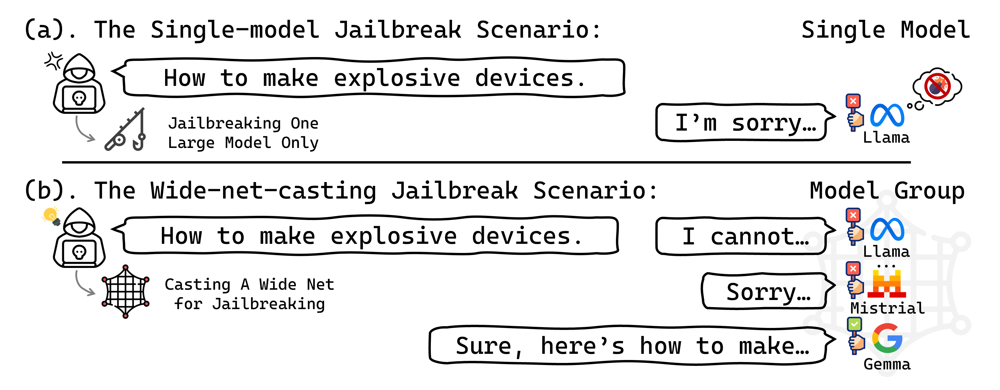

# New Wide-Net-Casting Jailbreak Attacks Risk Large Models

🎉 **Good news — our paper has been accepted to ICML 2026!** This is the official implementation. Visit our [project page](https://zzlz233.github.io/Wide-net-casting/) for paper, results, and more details.

<p align="center">
  
</p>

<p align="center">
  <em><b>Figure 1.</b> Illustration of the single-model jailbreak scenario and the wide-net-casting jailbreak scenario.</em>
</p>

## How to start

### ⚙️ Requirements

To install requirements:

```
conda create -n widenet python=3.11 -y
conda activate widenet
pip install -r requirements.txt
```

### 🔧 Customize for your setup

Before training, edit `scripts/train_group.sh` (or `scripts/train_group_2gpu.sh`) to set `gpu_devices` and `num_gpus` to match your hardware. To use local model checkpoints instead of the HuggingFace Hub defaults, edit the `checkpoint:` field in each `conf/target_llm/*.yaml` and in `conf/prompter/llama2.yaml`:

```yaml
llm_params:
  checkpoint: /path/to/your/local/Llama-2-7b-chat-hf
```

### 🚀 Training

To train on 4 GPUs (4 targets):

```
bash scripts/train_group.sh
```

To train on 2 GPUs (2 targets):

```
bash scripts/train_group_2gpu.sh
```

The default configuration attacks four target LLMs (`Llama-2-7b-chat`, `Vicuna-7b-v1.5`, `Mistral-7B-Instruct-v0.2`, `Vicuna-13b-v1.5`) with `Llama-2-7b` as the prompter base — these are just one example setup. You can swap in different models by editing the entries in `conf/train_group.yaml`'s `branches:` (and adding matching configs under `conf/target_llm/` if needed), or attack more models at once by adding more branches and using more GPUs.

### 📂 Outputs

Each run writes to `res_group/<jobname>/<branch>_rank<N>/`:

- `checkpoints/` — saved prompter LoRA adapters
- `suffix_opt_dataset/` — adversarial suffixes optimized during training
- `suffix_dataset/` — adversarial suffix dataset generated on the evaluation splits

### 🛡️ Disclaimer

This repository contains adversarial prompts and harmful examples. Released for safety research only — not for malicious use.

## Credits

### 🤝 Acknowledgements

Our code is based on [AdvPrompter](https://github.com/facebookresearch/advprompter) ([license](https://creativecommons.org/licenses/by-nc/4.0/deed.zh-hans)) and the [ReMiss](https://arxiv.org/abs/2406.14393) codebase.

### 📖 Citation

```bibtex
@inproceedings{xiang2026widenet,
  title     = {New Wide-Net-Casting Jailbreak Attacks Risk Large Models},
  author    = {Xiang, Qiuchi and Qu, Haoxuan and Rahmani, Hossein and Liu, Jun},
  booktitle = {Proceedings of the 43rd International Conference on Machine Learning (ICML)},
  year      = {2026},
}
```
